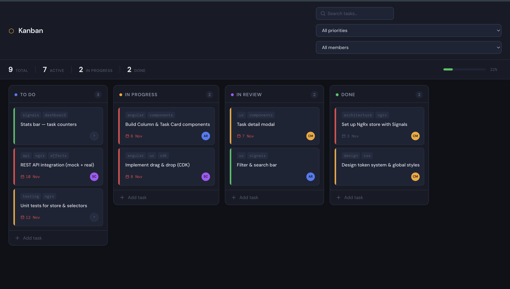

# Kanban Board

> A project management dashboard built to demonstrate modern Angular 21 patterns.



## Tech stack

- **Angular 21** — standalone components, signals, new control-flow syntax (`@if` / `@for`)
- **NgRx** — actions, reducer, selectors, effects (entity pattern)
- **Angular CDK** — drag and drop between columns
- **TypeScript 5.6** — strict mode throughout
- **SCSS** — CSS custom property design tokens

## Angular 21 features demonstrated

- `standalone: true` on every component — no NgModules
- `signal()` and `computed()` for local reactive state
- New template control flow: `@for`, `@if`, `@empty`, `@switch`
- `inject()` function-based dependency injection
- `ChangeDetectionStrategy.OnPush` on all components
- Lazy-loaded feature routes via `loadComponent` / `loadChildren`
- `createActionGroup` for typed NgRx action bundles
- Memoised NgRx selectors with filtering logic

## Running locally

```bash
npm install
npm start
# → http://localhost:4200
```

Install the [Redux DevTools](https://chrome.google.com/webstore/detail/redux-devtools/lmhkpmbekcpmknklioeibfkpmmfibljd) Chrome extension to inspect the store in real time.

## Running tests

```bash
npm test
```

Covers: reducer actions (add, update, delete, move), selectors (filtering, counts), and modal state.

## Project structure

```
src/app/
├── core/
│   ├── models/          # Task, Column, User types + mock data
│   ├── services/        # TaskService (mock → real API in Phase 3)
│   └── store/           # NgRx actions, reducer, selectors, effects
├── features/
│   ├── board/           # Main board view + components
│   │   └── components/
│   │       ├── board-header/   # Search & filters
│   │       ├── column/         # CDK drop list
│   │       ├── task-card/      # Presentational card
│   │       └── task-modal/     # Create / edit modal
│   └── dashboard/
│       └── components/
│           └── stats-bar/      # Task counters
└── shared/              # (Phase 2) reusable UI primitives
```

## Roadmap

- [x] Phase 1 — Core board, NgRx store, components
- [ ] Phase 2 — Drag & drop wiring, responsive, keyboard a11y, toasts
- [ ] Phase 3 — Real REST API with json-server → production backend
- [ ] Phase 4 — Zoneless CD, NgRx SignalStore, dashboard charts
- [ ] Phase 5 — GitHub Actions CI, Netlify deploy

---